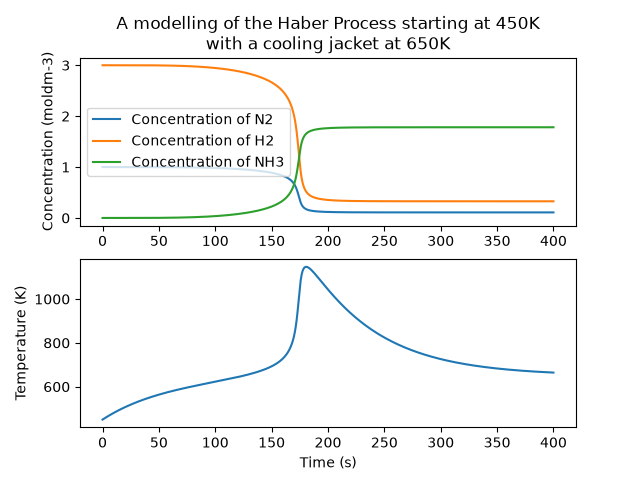

# Reaction Kinetics Simulator

Python models of chemical reaction kinetics, from analytically solvable
first-order decay through to a non-isothermal equilibrium system that
requires implicit integration.



## Models

| # | Model | Method |
|---|-------|--------|
| 1 | First-order decay, A → B | Analytic |
| 2 | Rate constant comparison | Analytic |
| 3 | Temperature dependence (Arrhenius) | Analytic |
| 4 | Consecutive reactions, A → B → C | Analytic |
| 5 | Reversible equilibrium, A ⇌ B | Analytic |
| 6 | Haber process, non-isothermal | Heun (explicit) |
| 7 | Haber process, non-isothermal | SciPy Radau (implicit) |

## Why two solvers for the Haber process

Coupling the Arrhenius equation to an energy balance makes the system
stiff. Heat release raises the temperature, which raises the rate
constant exponentially, which raises heat release further.

The Jacobian eigenvalue that limits explicit stability scales as
Ea/(RT²) × dT/dt, so the maximum stable timestep collapses as the
reactor heats: ~1.5 s at 700 K, 0.04 s at 900 K, 0.002 s at 1200 K.
A fixed-step explicit method therefore cannot complete the integration
at any single step size.

Switching to an adaptive implicit solver resolves the ignition event in
around 2,500 function evaluations, against the ~10⁸ a fixed 10 µs step
would need. Nitrogen and hydrogen atom balances are conserved to solver
tolerance.

## Running

Requires [uv](https://docs.astral.sh/uv/).

```bash
git clone https://github.com/aayanamalik/Reaction-Kinetics-Simulator
cd Reaction-Kinetics-Simulator
uv run src/kinetics/main.py
```

## Limitations

- Cp and mixture density are treated as constants
- The forward and reverse rate constants share a pre-exponential factor,
  so the implied equilibrium constant is not thermodynamically
  consistent with ΔH and ΔS
- The model assumes reaction conditions are isobaric
